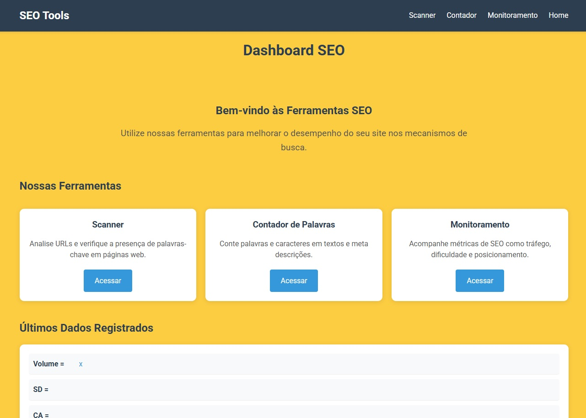

# Plataforma de Ferramentas SEO

Uma plataforma com ferramentas para auxiliar na otimização de sites para mecanismos de busca (SEO).


## Descrição

Este projeto consiste em três ferramentas principais para ajudar no processo de otimização de SEO:

1. **Scanner**: Analisa tags SEO importantes de um site (h1, title, meta description) e verifica a presença de palavras-chave.
2. **Contador de palavras-chave**: Conta caracteres em textos e verifica a frequência de palavras-chave específicas.
3. **Monitoramento**: Permite cadastrar e acompanhar métricas de SEO como volume de tráfego, dificuldade SEO e posicionamento.

## Tecnologias Utilizadas

- **Frontend**: HTML, CSS e JavaScript puro
- **Backend**: Node.js com Express
- **Web Scraping**: Puppeteer para extração de dados de sites

## Instalação

1. Clone o repositório
2. Instale as dependências:

```bash
npm install
```

3. Inicie o servidor:

```bash
npm run dev
```

## Ferramentas

### 1. Scanner

O Scanner analisa as principais tags SEO de um site e verifica se a palavra-chave está presente na meta description.

**Funcionalidades:**
- Extração de tags h1, title e meta description
- Verificação de palavra-chave na meta description
- Exibição formatada dos resultados

**Como usar:**
1. Acesse http://localhost:3000/scanner/index.html
2. Digite a palavra-chave desejada
3. Digite a URL do site a ser analisado
4. Clique em "GO"

### 2. Contador de palavras-chave

O Contador de palavras-chave permite analisar textos e verificar a frequência de palavras-chave específicas.

**Funcionalidades:**
- Contagem de caracteres em tempo real
- Verificação da frequência de palavras-chave no texto
- Feedback visual sobre o tamanho do texto

**Como usar:**
1. Acesse http://localhost:3000/contador-palavras/index.html
2. Digite a palavra-chave desejada
3. Digite ou cole o texto a ser analisado
4. Veja os resultados em tempo real

### 3. Monitoramento

O Monitoramento permite cadastrar e acompanhar métricas importantes de SEO.

**Funcionalidades:**
- Cadastro de métricas como volume de tráfego, dificuldade SEO e posicionamento
- Visualização das métricas cadastradas
- Acompanhamento de evolução ao longo do tempo

**Como usar:**
1. Acesse http://localhost:3000/monitoramento/index.html
2. Preencha os campos com as métricas desejadas
3. Clique em "cadastrar"
4. Visualize as métricas cadastradas

## Requisitos

- Node.js (v12 ou superior)
- NPM
- Navegador moderno (Chrome, Firefox, Edge)

## Dependências

- express: Framework para o servidor web
- puppeteer: Biblioteca para automação de navegador e web scraping
- cors: Para permitir requisições cross-origin
- nodemon: Para desenvolvimento com reinicialização automática do servidor